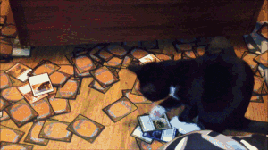

# `Magic the Gathering: Commander Graph`

---

<div style="display: flex; gap: 10px;">
  
  
</div>

### 📖 Overview
> 1. ⚡ Basic **SPA**
  >       - Uses [`scryfall`](https://scryfall.com/docs/api) → to render a network graph of Magic cards
> 2. 📊 Uses [`d3`](https://d3-graph-gallery.com/network.html) → for building a network chart

---

# ✨ `Getting Started →`

## `📦 [Step 1] Environment Setup`
- Install →
    ```bash
    # Run npm i
    cd ~/code/deck-graph/
    npm i
   
    # Verify setup went smoothly
    npm run test
    ```

##  `⚡ [Step 2] Running the Server`
- Run →
   ```bash
   # Start local dev env
   npm run dev
   
   # Open the browser
   open http://localhost:3000/
   ```
